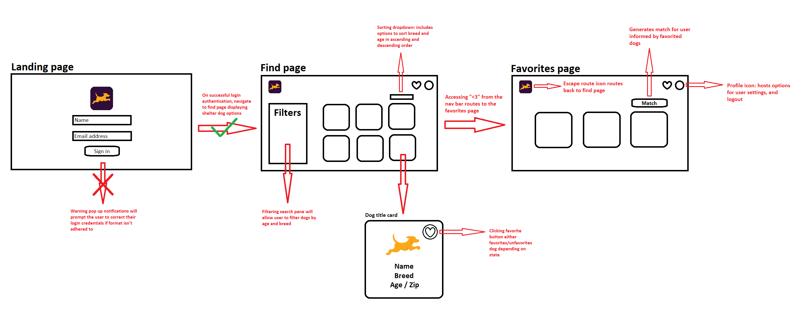

<br />
<div align="center">
    
    <h3>Frontend Take-Home Exercise</h3>
    <a href="https://gojakobii.github.io/FetchFind/">Visit FetchFind</a>
</div>

# Imports Used

- Tailwind CSS - CSS styling framework
- Headless UI - UI component library
- Heroicons - SVG icons
- react-router-dom - dynamic browser routing

# About

FetchFind is a responsive website that helps connect dog-lovers with shelter dogs; fetching their forever friend.

# Process

## Sketch



## User-based Testing

Aimed to evaluate the user experience and effectiveness of the FetchFind website. The test participants were asked to complete specific tasks while communicating their thoughts during their trials. The objective was to identify usability issues, understand user preferences, and gather feedback for future improvements.

**Introduction and Context**: I introduced the purpose of the usability test and provided an overview of the website's features and functionality: the website hosts a database of shelter dogs and generates matches based on user's favorites.

**Task Instructions**: Each participant was presented with a set of tasks to complete

1. Provide login credentials and successfuly sign in
2. Browse the search page and filter dogs based on preferences (breed and age)
3. Select a few preferred dogs and add them to the "Favorites" list
4. Generate a dog match based on the chosen dogs
5. Provide feedback on the website's usability, design, and overall experience.

### Moderated think-aloud testing

**Feedback**: The user expressed want for a more visible way to identify which dog breeds they selected for filtering. They described the current method of scrolling through all the options to determine their selected breeds as cumbersome. Furthermore, the participant highlighted the need for better dilineation of the age and zip code fields per dog.

In addition to the valuable feedback, it was evident that the participant thoroughly enjoyed exploring the website and browsing through the various dog profiles. They found the 'no results' message particularly amusing. Their enthusiastic engagement is indicative of the websites' successful user experience, design shortcomings nonwithstanding.

**Implementation**: To address breed filtering, implementing a clear visual indicator of breed would greatly improve the user's ability to discern their choices at a glance. By having buttons corresponding to selected breeds above the filter scroll bar, not only is there a visual cue for filtered breeds, but it also allows a convenient method for users to modify their search criteria via removing breeds.

In terms of better defining age and zip code from one another, I included headers above either field as descriptors.

### Retrospective unmoderated testing

**Feedback**: In conclusion, the participant had great, positive initial impressions, specifically regarding the choice of colors and the overall visual appeal of the website. That being said, they recommended incorporating some Fetch-related imagery on the landing page to further reinforce the website's theme and association with Fetch.

When it came to browsing dogs, the user liked the ability to customize their search based on fields such as breed and age. They suggested incorporating the dog's sex and color as filtering options, too, for a more personalized browsing experience.

Lastly, the participant raised questions about the match generation algorithm. They advised exploring a more interactive, questionnaire-like approach in lieu of randomization. They also encountered several bugs related to the sorting options and unresposiveness of buttons and results; however, I was unable to reproduce these errors during subsequent testing.

**Implementation**: I added the Fetch logo above the sign-in form to enhance clarity. Although I acknowledge that the addition of attributes like sex and color would be valuable, they fall outside the scope of the assignment. Similarly, there aren't many other characteristics I can consider during match generation that aren't already accounted for in the filtering process. While I could design a questionnaire with lifestyle-related questions and other user preferences to create the illusion of choice, ultimately, the match would still be arbitrary. Therefore, I believe the current setup is satisfactory.

# Downloading the Project

This project was bootstrapped with [Create React App](https://github.com/facebook/create-react-app).

## Prerequisites

1. Clone down the FetchFind frontend repository and change directories

```console
git clone https://github.com/gojakobii/FetchFind.git
cd FetchFind
```

2. Install dependencies

```console
npm install
```

3. Run the app in development mode. Open http://localhost:3000 to view it in your browser.

```console
npm start
```
